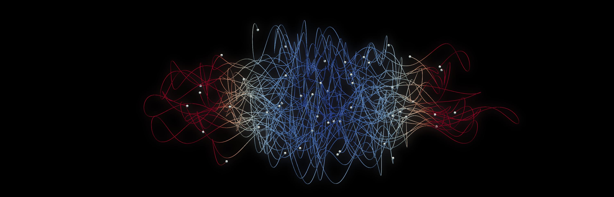
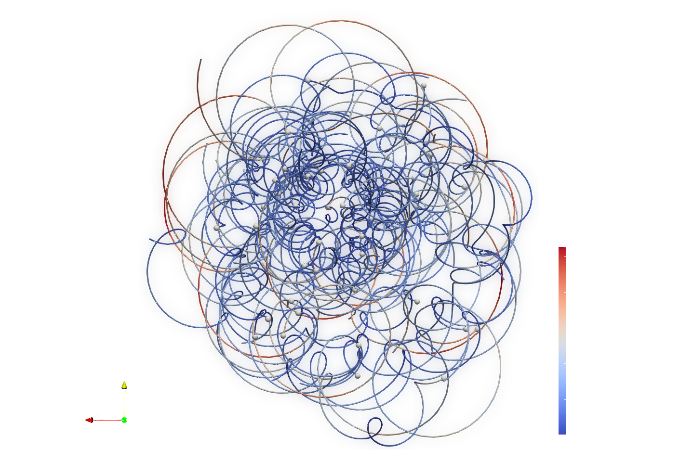
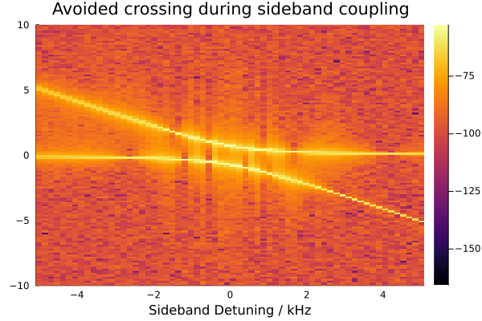
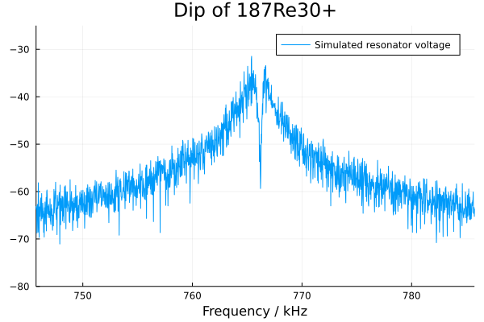
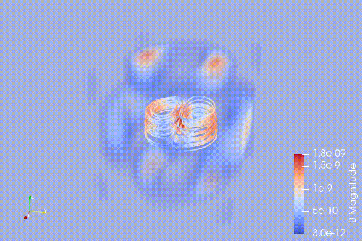
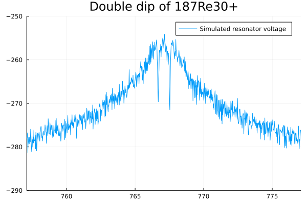
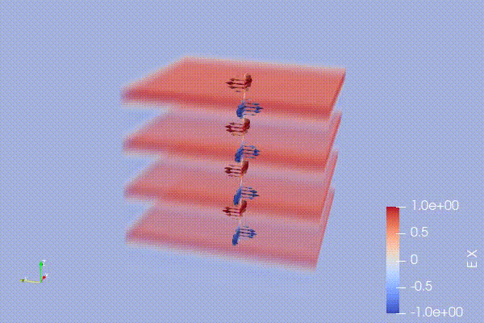
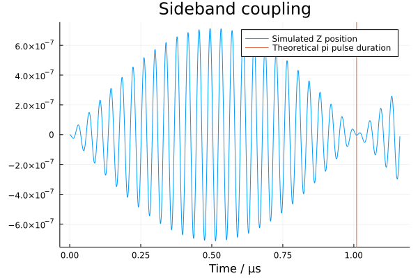

<h1 align="center">
  Penning.jl
</h1>

<!-- description -->
<p align="center">
  <strong>~ Flexible and extensible Julia framework for simulating the motion of particles in Penning traps ~</strong>
  <br/>
  <a href="https://jherkenhoff.github.io/Penning.jl/"><strong>Explore the docs »</strong></a>
    <br />
    <br />
    <a href="https://github.com/jherkenhoff/Penning.jl/issues/new">Report Bug</a>
    ·
    <a href="https://github.com/jherkenhoff/Penning.jl/issues/new">Request Feature</a>
</p>



<br/>
<br/>
Penning.jl is a flexible and extensible simulation framework written in Julia that uses a symplectic time stepper to solve for the motion of charged particles in a Penning trap and features an integrated circuit simulator that is coupled to the Penning trap simulation.
It scales from simple single-particle systems up to complex N-body problems, possibly in multiple interconnected Penning-traps.
Penning.jl comes with many builtin features like a variety of excitation fields, including dipolar fields, plane waves and cavity modes, support for different damping mechanisms, noise injection and more. The integrated circuit simulator can be used to model the coupling of particles to a user-defined external circuit, most commonly an RLC tank circuit.


The interface was designed to make Penning.jl as friendly and intuitive to use as possible. An in-built collection of diagnostics and file-writers enables post-processing directly in Julia or 3rd party applications.

##### What Penning.jl is not

- Full electromagnetic code (that is, it does not solve the maxwell equations).
- Plasma simulator for large (>10.000) numbers of particles (Particle-in-Cell codes might be better suited for this task)

## Contents

* [Installation instructions](#installation-instructions)
* [Running your first simulation](#running-your-first-simulation)
* [Gallery](#gallery)
* [Circuit Simulator](#circuit-simulator)
* [Development](#development)

## Installation instructions

You can install the latest version of Penning using the built-in package manager (accessed by pressing `]` in the Julia command prompt):

```julia
julia>]
(v1.6) pkg> add https://github.com/jherkenhoff/Penning.jl.git
```


## Running your first simulation

```julia
using Penning

# Set up a Penning trap:
trap = Trap(
  fields = (
    IdealTrapField(5.0, -14960.0, 7.0),
    # Here, you could add further fields like excitations, inhomogenieties etc.
  ),
  particles = (
    ParticleCollection(Electron(), [0, 0, 1], [0, 0, 0]),
  )
)

# Create a simulation setup and add the previously instantiated trap
setup = Setup(
  traps = (trap,)
)

# Setup a simulation object
sim = Simulation(setup, 
    dt = 1e-13,
    stop_time = 1e-10,
    output_writers = (
        VtkParticleWriter("data/particles", 1, 1, IterationInterval(5)) # Writes the positions of the 1st particle collection in the 1st trap to a file named "data/particles.pvd" at each 5th simulation iteration
    )
)

# Run the simulation...
run!(sim)
```


## Gallery

</img>
</img>
</img>

</img>
</img>
</img>

</img>


## Circuit Simulator

Penning.jl provides the possibility to build arbitrary electronic circuits that can be "attached" to electrodes of a Penning trap.
Two different techniques can be used to model the behaviour of the circuit:
- You can use a block-oriented approach, in which you instantiate circuit components like resistors, capacitors etc. and specify their connections. Under the hood, [ModelingToolkit.jl](https://mtk.sciml.ai/dev/), an equation based modeling framework, converts this abstract representation into their underlying differential equations. This allows us to build complex circuits without having to do any hand calculations. Unfortunately, this comes at the price of significantly longer compilation times and a slightly slower simulation runtime. **Unfortunately, this type of circuit modelling is temporarily not available due to changes in the internal structure of Penning.jl.**
- You can manually enter the differential equation of the circuit in [state space representation](https://en.wikipedia.org/wiki/State-space_representation) (SS). This technique requires more analytical hand-calculations prior to the simulation, but rewards you by being significantly faster. A collection of commonly used circuits are build in for convenience, so that you most certainly dont need to set up the differential equations yourselve (e.g. SSCircuitResistor or SSCircuitResonator).

## Development

If you want to extend Penning with new features, fix bugs, or simply play around with the source code, you first need to get a copy of the Penning.jl repository:
```
git clone https://github.com/jherkenhoff/Penning.jl.git
```

After that, `cd` into that directory and execute the following commands to fetch Penning's dependencies:
```julia
julia>]
(v1.6) pkg> activate .
(v1.6) pkg> instantiate
```

## Building the documentation

```
cd docs
julia make.jl
```

## References

1. Boris, J.P. (1970) ‘Relativistic plasma simulation-optimization of a hybrid code’, in Proceeding of Fourth Conference on Numerical Simulations of Plasmas. United States Naval Research Office, pp. 3–67.
