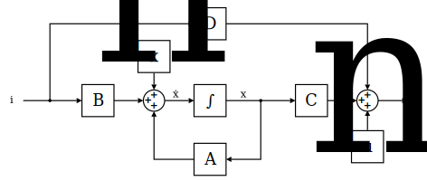

## State-space representation
In Penning.jl, circuits are implemented in [state-space representation](https://en.wikipedia.org/wiki/State-space_representation), which is a technique to describe and solve systems of differentials equations in the time domain.

### Theory
In general, electrical circuits can be described as a $n$th-order ordinary differential equation with $n$ concentrated energy reservoirs. In state-space representation, this equation is decomposed into $n$ 1st-order differential equations and put into a matrix/vector representation.

The **state** of such a system is fully described by the energy content of its $n$ energy reservoirs, called the state variables. State variables are, for example, the voltage of a capacitor, the current in an inductor, in a spring-mass system the deflection of the spring or the velocity of the mass. In state-space representation the individual state variables are composed into a state vector $x$.

The **behaviour** of such a system is fully described by a set of system-matrices:
- The state matrix $\mathbf{A}$ describes how the state vector changes depending on the current state vector
- The input matrix $\mathbf{B}$ describes how the state vector changes depending on the current input vector
- The output matrix $\mathbf{C}$ translates the current state vector into an output vector
- The feedthrough matrix $\mathbf{D}$ translates the current input vector into an output vector

The **inputs** and **outputs** of a system modeled in state-space representation are encapsulated in the input and output vectors $i$ and $u$. While in general state-space modeling there are no restrictions on the physical units associated with the inputs and outputs, for Penning.jl they are fixed:
The circuit-cosimulation functionality in Penning.jl is solely designed to calculate the voltages on electrodes of a Penning-trap as a function of its induced image currents. The induced currents are calculated during particle simulation, which is why we can treat it as a given input quantity for the circuit cosimulation. Our model has to accept the induced currents as an input and should output the associated voltages (which is why the input vector is named $i$ and the output vector is named $u$). Care must be taken when a circuit provides multiple inputs and outputs. In that case, the current on the first input must correspond to the voltage on the first output, and so on.
In sloppy mathematical notation, we could write this as
```math
\left[ \begin{array}{c}
u_\textnormal{electrode1}(t) \\
u_\textnormal{electrode2}(t)
\end{array} \right]
 = \textnormal{Circuit}\left(\left[ \begin{array}{c}
i_\textnormal{electrode1}(t) \\
i_\textnormal{electrode2}(t)
\end{array} \right]\right)
```
for an examplary circuit with two electrode-connections.


The state-space representation is often visualized as a block diagram, showing the interplay between system-matrices and vectors:



It must be noted that the blocks labeled $x_n$ and $u_n$ do not comply with the common state-space representation, but are an extension for Penning.jl to model **noise**:
- The vector $x_n$ models noise that is added to the state vector
- The vector $u_n$ models noise that is added to the output vector

With all these definitions out of the way, the state-space representation can be algebraicly described using the **state equation**
```math
\dot{\mathbf{x}}(t) = \mathbf{A}(t) \mathbf{x}(t) + \mathbf{B}(t) \mathbf{i}(t) + \mathbf{x}_n(t)
```
and the **output equation**
```math
\mathbf{u}(t) = \mathbf{C}(t) \mathbf{x}(t) + \mathbf{D}(t) \mathbf{i}(t) + \mathbf{u}_n(t)\,.
```

### Example: Resistor


### Example: Capacitor

Lets look at a more elaborate example: The state-space representation of a simple capacitor.

From the current-voltage relation of a capacitor
```math
v(t) = v_0 + \frac{1}{C} \int_{t_0}^t i(\tau) \text d \tau
```
we see that a capacitor is not time-dependent due to the integral from time $t_0$ to $t$ and is said to be a **stateful component**. We have to decide what quantity we want to use as its internal state. In this derivation we will use its voltage, but another viable option would be its charge $Q = v\,C$.

The **input matrix** $\mathbf{B}$ 